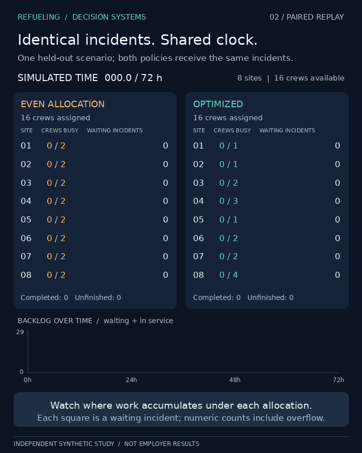
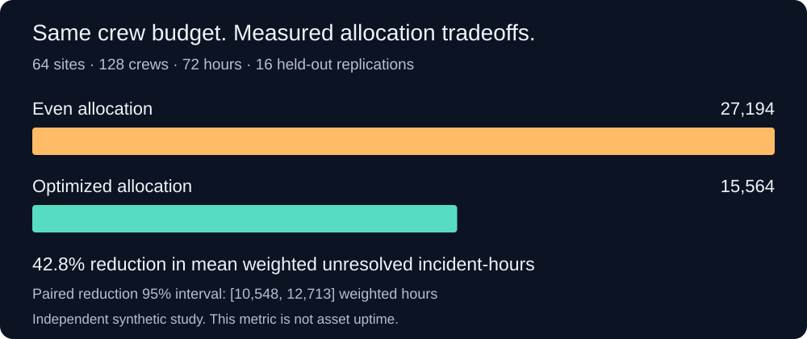

# Generated continuity visuals

Source revision: [9dc0ea183f9e4c2348efabebc481eb5993296e13](https://github.com/tmummidi/Refueling/tree/9dc0ea183f9e4c2348efabebc481eb5993296e13).

[Watch or download the 60-second MP4](continuity_demo.mp4) · [Evidence](continuity_demo.json) · [Source and asset fingerprints](manifest.json)

The 8-site replay is one held-out simulation. The 64-site chart summarizes 16
independent replications. These are synthetic incidents, not employer systems.
The video is silent with captions. Its source is in the main branch's visuals/
directory. This branch is regenerated after verified model/renderer changes;
commits preserve previous visual releases. Do not edit generated files here.
